# hpc_project_nearest_neighbours

Speeding up cosine-similarity nearest-neighbour search on CPU (OpenMP) and GPU
(CUDA), benchmarked on GloVe word embeddings

## What's implemented

The project compares brute force, LSH, HNSW, and KD-tree nearest-neighbour
search on CPU and CUDA. All benchmarked query workloads use top-10 search.

| method | CPU implementation | CUDA implementation | exact? |
|---|---|---|---|
| Brute force | OpenMP baselines in `lsh.cpp`, `hnsw.cpp`, `kd_tree.cpp` | custom CUDA kernels in `lsh_cuda.cu`, `hnsw_cuda.cu`, `kd_tree_cuda.cu` | yes |
| SimHash LSH | `cpp/lsh.cpp` | `cpp/lsh_cuda.cu` | approximate |
| HNSW | `cpp/hnsw.cpp` | `cpp/hnsw_cuda.cu` | approximate |
| KD-tree | `cpp/kd_tree.cpp` | `cpp/kd_tree_cuda.cu` | yes |

### Parallelism

**LSH CPU** (`cpp/lsh.cpp`) supports multiple OpenMP query modes:
`queries`, `queries_dyn`, `tables`, `candidates`, `features`, `query_table`,
and `all`. The fastest practical mode in these experiments is usually
`queries`, which parallelises independent queries. Other modes explore
parallelism over hash tables, candidate reranking, and feature reductions.

**LSH CUDA** (`cpp/lsh_cuda.cu`) parallelises more than independent queries:
cuBLAS computes point/query projections, `pack_signs` creates signatures, Thrust
sorts buckets per table, one thread handles each `(query, table)` lookup, one
block gathers each bucket, and one block per query reranks candidates.

**HNSW CPU** (`cpp/hnsw.cpp`) supports `serial`, `queries`, `queries_dyn`,
`neighbors`, `features`, and `build`. `queries` parallelises independent
queries; `neighbors` parallelises distance checks over candidate neighbour
lists; `features` parallelises dot-product feature reductions; `build` uses a
parallel graph build with striped node locks.

**HNSW CUDA** (`cpp/hnsw_cuda.cu`) builds the HNSW graph on CPU, performs
upper-layer greedy descent on CPU, then runs layer-0 beam search on GPU with one
warp per query. The CUDA brute baseline is exact and used for recall.

**KD-tree CPU** (`cpp/kd_tree.cpp`) has build modes `serial`, `parallel-tasks`,
and `parallel-flat`, plus query modes `serial`, `local-heaps`, and
`atomic-global`. The `serial` query mode still parallelises the batch over
queries; `local-heaps` and `atomic-global` explore intra-query traversal
parallelism.

**KD-tree CUDA** (`cpp/kd_tree_cuda.cu`) builds a flat KD-tree on CPU and runs
one GPU thread per query. Each thread keeps its traversal stack and top-k heap in
registers. This works very well for low-dimensional clustered data, but loses to
GPU brute force in 50d/100d due to the curse of dimensionality.

**Datasets** are prepared from GloVe `6B` and `twitter.27B` via
`scripts/prepare_glove.py`, plus a synthetic clustered `10d` dataset used to
show where exact KD-tree pruning is effective.

## Setup

```bash
uv venv --python 3.11 && source .venv/bin/activate
uv pip install numpy scikit-learn matplotlib tqdm requests

# CPU build  (g++, OpenMP)
make -C cpp lsh hnsw kd_tree

# GPU build  (nvcc, cuBLAS, thrust; needs CUDA 12+)
make -C cpp lsh_cuda hnsw_cuda kd_tree_cuda

# all targets
make -C cpp
```

## Dataset prep

```bash
# small visualisable subset
python scripts/prepare_glove.py --source 6B --dim 50 --n 20000

# benchmark scale (downloads ~1.5 GB zip, cached in data/)
python scripts/prepare_glove.py --source twitter.27B --dim 100 --n 1000000

# raw binary for the C++/CUDA binaries
python scripts/export_for_cpp.py --dim 100 --n 1000000
```

For KD-tree sanity checks, the repo also uses a synthetic low-dimensional
dataset: `data/synthetic10_1000000` (`N=1M`, `D=10`). It contains 256 clusters of
unit-normalised vectors with small Gaussian noise. This is intentionally
different from GloVe: it demonstrates the regime where KD-tree pruning is
effective and exact KD-tree search beats brute force.

The synthetic dataset is reproducible and should not be pushed to GitHub. It is
generated locally with a fixed seed:

```bash
python scripts/prepare_synthetic10.py

# smaller variant used for a fast CUDA HNSW datapoint
python scripts/prepare_synthetic10.py --n 200000
```

Generation details: sample 256 random 10d cluster centres from a standard normal
distribution, L2-normalise them, assign each of `N` points to a random centre,
add Gaussian noise with standard deviation `0.03`, then L2-normalise every point.
The default seed is `42`, so repeated runs produce the same files.

Outputs in `data/`:

| file | type | notes |
|---|---|---|
| `glove<dim>_<N>.npy` | float32 (N, dim) | raw GloVe vectors |
| `glove<dim>_<N>_norm.npy` | float32 (N, dim) | L2-normalised |
| `glove<dim>_<N>.f32` | raw float32 | row-major, used by C++/CUDA |
| `glove<dim>_<N>.shape` | text | `N D` header |
| `glove<dim>_<N>_words.txt` | N lines | row-aligned tokens |
| `synthetic10_1000000.*` | float32 / metadata | clustered 10d benchmark for KD-tree |

## Visualise neighbours

```bash
python scripts/visualize_neighbors.py --word king --k 10
# prints cosine kNN, writes data/nn_king.png (PCA-2D, query + neighbours highlighted)
```

## Running the algorithms

```bash
# CPU LSH
./cpp/lsh data/glove100_1000000 --L 32 --K 12 --queries 500 --topk 10 --mode queries

# CUDA LSH / brute
./cpp/lsh_cuda data/glove100_1000000 --L 32 --K 12 --queries 500 --topk 10 --mode cuda_lsh
./cpp/lsh_cuda data/glove100_1000000 --queries 500 --topk 10 --mode cuda_brute

# CPU HNSW
./cpp/hnsw data/glove100_1000000 --M 16 --ef_construction 200 --ef 50 --queries 500 --topk 10 --mode build

# CUDA HNSW / brute
./cpp/hnsw_cuda data/glove100_1000000 --M 16 --ef_construction 200 --ef 50 --queries 500 --topk 10 --mode cuda_hnsw
./cpp/hnsw_cuda data/glove100_1000000 --queries 500 --topk 10 --mode cuda_brute

# CPU KD-tree / brute
./cpp/kd_tree data/glove100_1000000 --build-mode parallel-flat --query-mode serial --k 10 --iters 500 --threads 8

# CUDA KD-tree / brute
./cpp/kd_tree_cuda data/glove100_1000000 --queries 500 --topk 10 --mode cuda_kdtree
./cpp/kd_tree_cuda data/glove100_1000000 --queries 500 --topk 10 --mode cuda_brute
```

## Benchmarks

### CPU OpenMP strong scaling

```bash
scripts/bench.sh                                   # default: dim=100, N=1M, L=32 K=12
MODES="queries tables candidates features" PLOT=1 scripts/bench.sh
```

Writes `results/scaling_modes_<...>.csv` (and PNG when `PLOT=1`). Below: same
workload, varying OpenMP threads and parallelism axis.

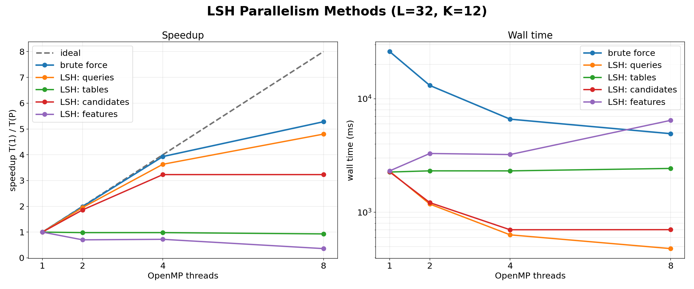

Takeaways: parallel-over-queries is the only mode that scales near-ideal up to
the 8 physical cores; parallel-over-tables and -candidates plateau early due to
serial dedupe/merge tails; parallel-over-features is *slower* than serial — D=100
is too small for OpenMP to beat SIMD.

### LSH CPU vs CUDA

```bash
scripts/bench_cuda.sh   # produces results/cuda_compare_L32_K12.{csv,png}
```

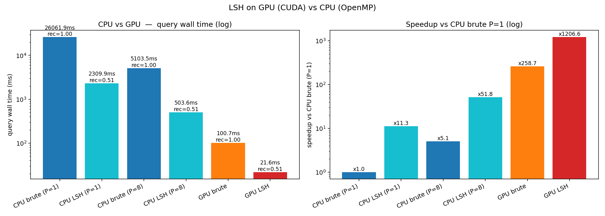

### HNSW CPU vs CUDA

```bash
# Small dataset, useful for fast iteration.
DIM=50 N=20000 SOURCE=6B QUERIES=500 PLOT=1 scripts/bench_hnsw_cuda.sh

# 1M dataset. Use CPU_MODE=build to use the parallel HNSW build path.
CPU_MODE=build CPU_THREADS="8" DIM=100 N=1000000 SOURCE=twitter.27B \
  QUERIES=500 PLOT=1 scripts/bench_hnsw_cuda.sh

# HNSW recall/speed sweep over ef on the small dataset.
DIM=50 N=20000 SOURCE=6B QUERIES=500 THREADS=8 MODES="queries" \
  PLOT=1 scripts/bench_hnsw_ef.sh
```

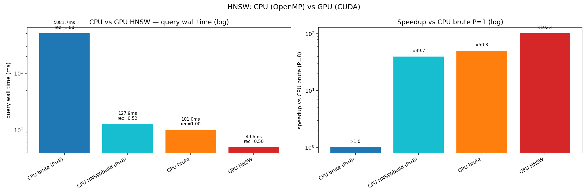

Important note: HNSW index construction is much more expensive than LSH bucket
construction at 1M points. On the L40S run below, HNSW query time was
competitive, but the HNSW build took about 744 seconds.

### HNSW OpenMP strong scaling

```bash
DIM=50 N=20000 SOURCE=6B QUERIES=500 TOPK=10 M=16 EF_CONSTRUCTION=200 EF=50 \
  THREADS="1 2 4 8" MODES="queries neighbors features" PLOT=1 \
  scripts/bench_hnsw.sh
```

This writes `results/hnsw_scaling_M16_ef50.csv` and
`results/hnsw_scaling_M16_ef50.png`.

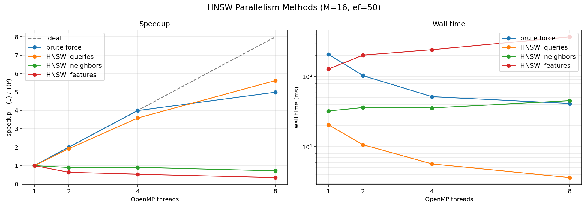

Latest HNSW scaling on `N=20k`, `D=50`, `Q=500`, `M=16`, `ef=50`:

| mode | P=1 | P=2 | P=4 | P=8 | recall |
|---|---:|---:|---:|---:|---:|
| brute force | 205.72 ms | 102.70 ms | 51.55 ms | 41.23 ms | 1.0000 |
| HNSW `queries` | 20.45 ms | 10.66 ms | 5.70 ms | 3.64 ms | 0.9716 |
| HNSW `neighbors` | 32.24 ms | 36.04 ms | 35.60 ms | 45.25 ms | 0.9716 |
| HNSW `features` | 127.32 ms | 200.78 ms | 239.82 ms | 365.48 ms | 0.9716 |

Takeaway: parallelising independent queries is the useful OpenMP strategy for
this workload. The `neighbors` and `features` modes add enough synchronization
and reduction overhead that they slow down as thread count increases.

### HNSW vs LSH

```bash
python scripts/plot_hnsw_lsh_summary.py
```

The combined summary script reads:

- `results/hnsw_lsh_small_N20000_summary.csv`
- `results/hnsw_lsh_1M_100d_summary.csv`

and writes:

- `results/hnsw_separate_visualization.png`
- `results/hnsw_vs_lsh_visualization.png`

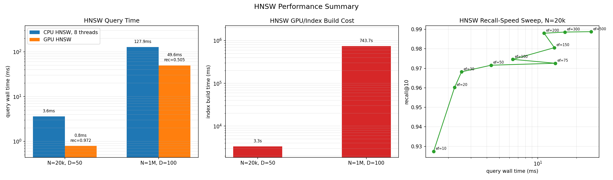

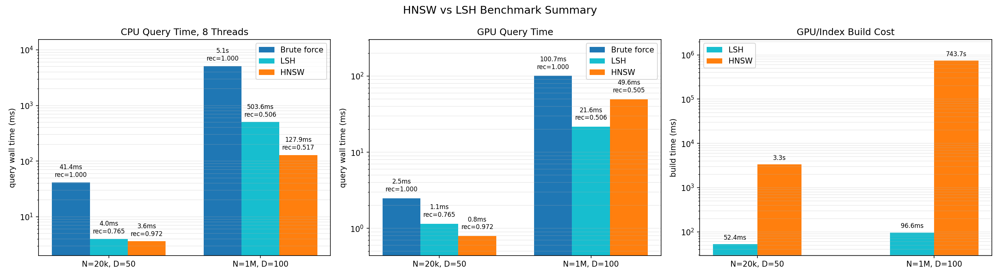

### KD-tree

```bash
# GloVe embeddings: KD-tree scaling on 20k x 50d and 1M x 100d.
DIM=50 N=20000 SOURCE=6B ITERS=500 THREADS="1 2 4 8" PLOT=1 scripts/bench_kdtree.sh

DIM=100 N=1000000 SOURCE=twitter.27B ITERS=500 THREADS="1 2 4 8" \
  BUILD_MODES="serial parallel-flat" QUERY_MODES="serial" \
  PLOT=1 scripts/bench_kdtree.sh

# Synthetic low-dimensional case where KD-tree should win.
python scripts/prepare_synthetic10.py

OMP_NUM_THREADS=8 ./cpp/kd_tree data/synthetic10_1000000 \
  --build-mode parallel-flat --query-mode serial --k 10 --iters 500 --threads 8
OMP_NUM_THREADS=8 ./cpp/lsh data/synthetic10_1000000 \
  --L 32 --K 12 --topk 10 --queries 500 --mode queries
OMP_NUM_THREADS=8 ./cpp/hnsw data/synthetic10_1000000 \
  --M 16 --ef_construction 200 --ef 50 --topk 10 --queries 500 --mode build
```

KD-tree plots:

- `results/kdtree_D50_N20000.png`
- `results/kdtree_D100_N1000000.png`
- `results/kdtree_D10_N1000000.png`

Combined comparison plots:

```bash
python scripts/plot_kdtree_comparison.py \
  --csv results/kdtree_lsh_hnsw_summary.csv \
  --out results/kdtree_vs_lsh_hnsw_visualization.png

python scripts/plot_kdtree_comparison.py \
  --csv results/kdtree_lsh_hnsw_10d_summary.csv \
  --out results/kdtree_vs_lsh_hnsw_10d_visualization.png
```

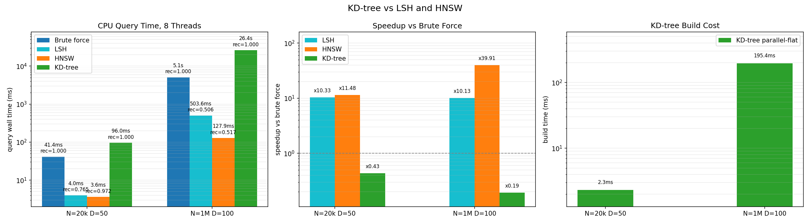

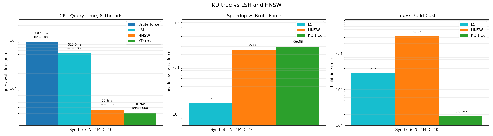

### Presentation figures

Presentation-ready figures are generated by:

```bash
python scripts/create_presentation_plots.py
```

They are written to `results_presentation/`. The per-method plots compare each
algorithm against the matching brute-force baseline for CPU P=1, CPU P=8, and
GPU on the available `10d`, `50d`, and `1M 100d` workloads.

Per-method query time vs matching brute force:

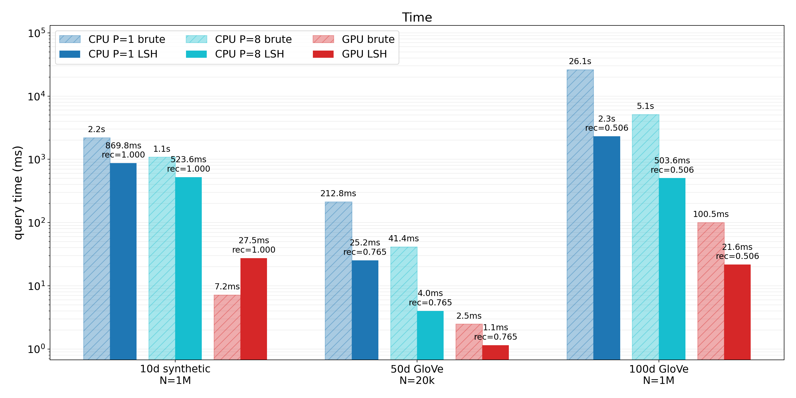

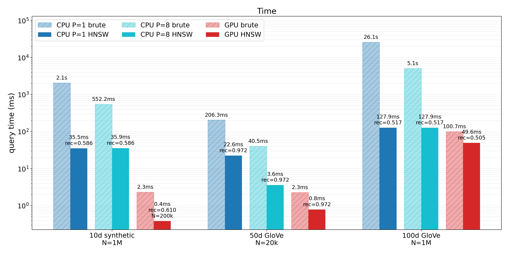

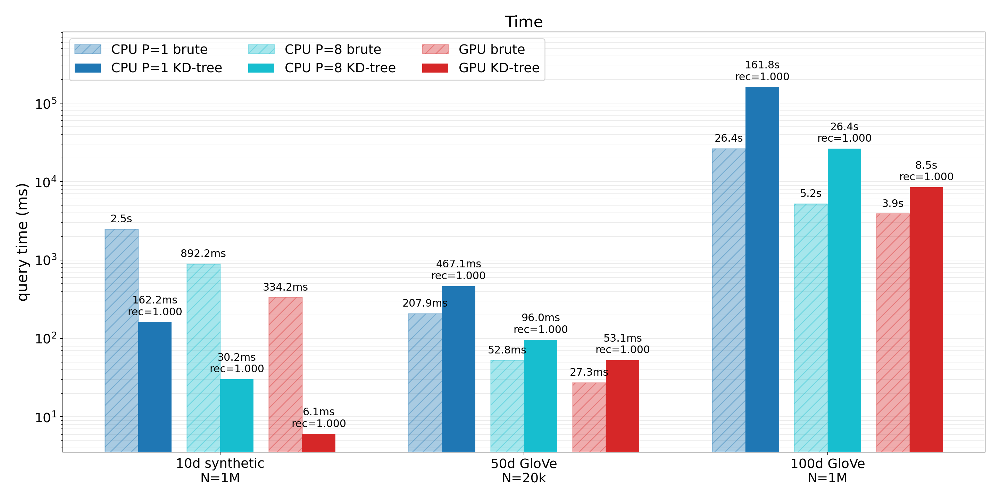

Per-method speedup vs matching brute force:

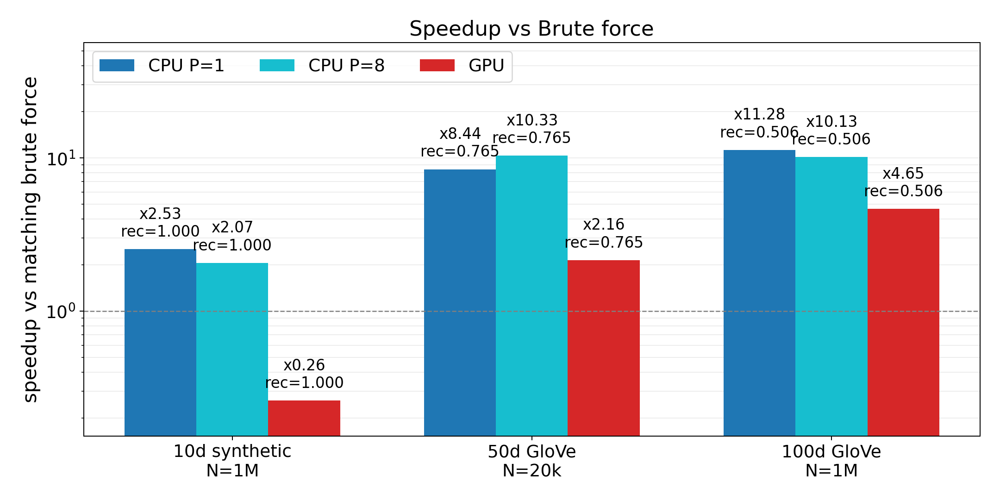

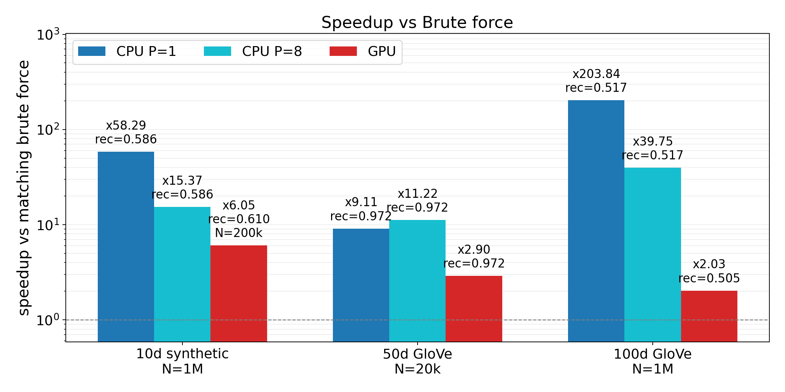

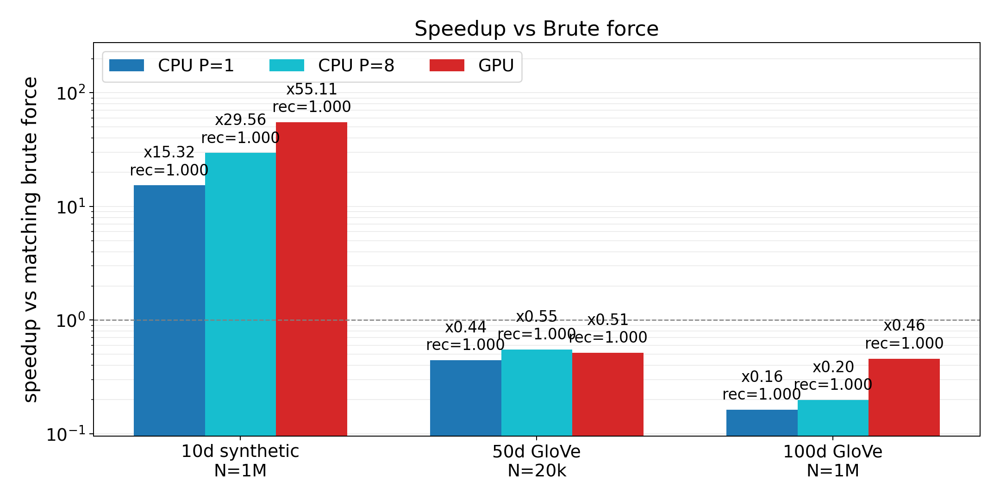

All implemented methods, CPU and GPU:

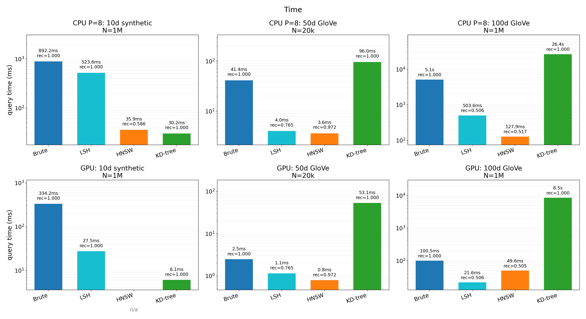

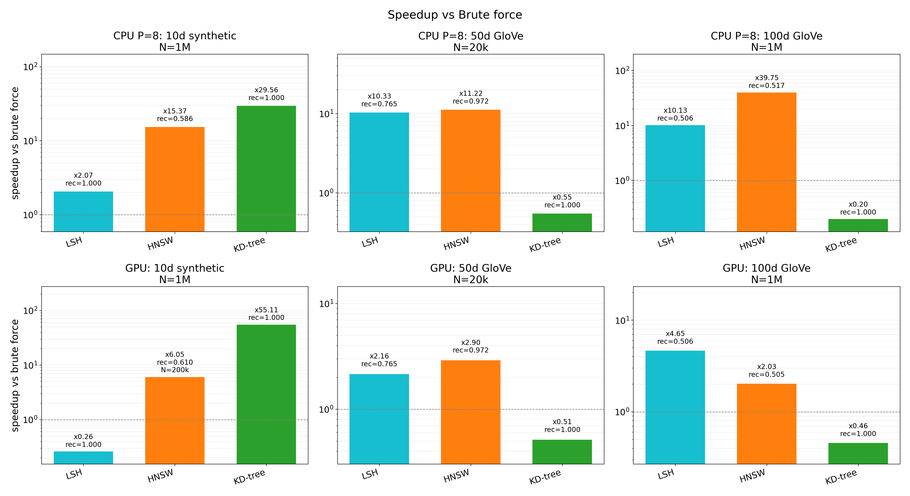

### Latest numbers on L40S vs 8-core CPU

LSH, `N=1M`, `D=100`, `Q=500`, `L=32`, `K=12`, top-10:

| method | wall time | recall | speedup vs CPU brute P=1 |
|---|---|---|---|
| CPU brute, P=1 | 26 062 ms | 1.00 | 1x |
| CPU LSH, P=1   | 2 310 ms  | 0.506 | 11x |
| CPU brute, P=8 | 5 104 ms  | 1.00 | 5x |
| CPU LSH, P=8   | 504 ms    | 0.506 | 52x |
| GPU brute      | 101 ms    | 1.00 | 259x |
| GPU LSH        | 22 ms     | 0.506 | 1207x |

HNSW, `N=1M`, `D=100`, `Q=500`, `M=16`, `ef=50`, top-10:

| method | wall time | recall | build time |
|---|---|---|---|
| CPU brute, P=8 | 5 082 ms | 1.00 | - |
| CPU HNSW, P=8  | 128 ms   | 0.517 | CPU build included before query |
| GPU brute      | 101 ms   | 1.00 | - |
| GPU HNSW       | 50 ms    | 0.505 | 743 661 ms |

Small dataset, `N=20k`, `D=50`, `Q=500`:

| method | wall time | recall | build time |
|---|---|---|---|
| CPU LSH, P=8  | 4.01 ms | 0.765 | - |
| CPU HNSW, P=8 | 3.61 ms | 0.972 | - |
| GPU LSH       | 1.15 ms | 0.765 | 52 ms |
| GPU HNSW      | 0.79 ms | 0.972 | 3 345 ms |

At these settings, HNSW gives much higher recall on `N=20k` and similar recall
to LSH on `N=1M`. GPU LSH remains the better throughput/build-time option at
1M because its index construction is orders of magnitude cheaper.

KD-tree on GloVe, CPU only, `Q=500`, 8 threads:

| dataset | method | wall time | recall/exactness | build time |
|---|---|---|---|---|
| `N=20k`, `D=50` | brute | 41.43 ms | exact | - |
| `N=20k`, `D=50` | KD-tree | 96.01 ms | exact | 2.33 ms |
| `N=1M`, `D=100` | brute | 5 103.51 ms | exact | - |
| `N=1M`, `D=100` | KD-tree | 26 423.07 ms | exact | 195.44 ms |

In 50d/100d GloVe embeddings, KD-tree is slower than brute force because it
visits too much of the tree. On `N=1M`, `D=100`, it visits about 999k nodes per
query.

Synthetic clustered low-dimensional data, `N=1M`, `D=10`, `Q=500`, 8 threads:

| method | wall time | recall/exactness | build time | speedup vs brute |
|---|---|---|---|---|
| brute | 892.19 ms | exact | - | 1x |
| KD-tree | 30.18 ms | exact | 175.04 ms | 29.56x |
| LSH | 523.57 ms | 0.9998 | 2 876 ms | 1.70x |
| HNSW (`ef=50`) | 35.93 ms | 0.5858 | 32 160 ms | 24.83x |

This synthetic 10d case shows the expected KD-tree behaviour: low dimension and
cluster structure allow effective pruning, so KD-tree beats brute force by about
30x while remaining exact. KD-tree visits only about 3k nodes per query on this
dataset, compared with almost all 1M nodes per query on the 100d GloVe run. The
benchmark uses `Q=500`; running `Q=1M` would require about `10^12` brute-force
comparisons for ground truth.

## Repo layout

```
cpp/
  lsh.cpp        # CPU LSH + brute (OpenMP, --mode flag)
  lsh_cuda.cu    # GPU LSH + brute (cuBLAS + thrust + custom kernels)
  hnsw.cpp       # CPU HNSW + brute (OpenMP modes)
  hnsw_cuda.cu   # GPU HNSW query/brute comparison
  kd_tree.cpp    # CPU KD-tree + brute (OpenMP modes)
  kd_tree_cuda.cu # GPU KD-tree + brute
  Makefile       # builds CPU and CUDA binaries

scripts/
  download_glove.sh   # direct GloVe download helper
  prepare_glove.py    # download + slice GloVe
  prepare_synthetic10.py  # deterministic synthetic 10d benchmark data
  export_for_cpp.py   # .npy -> .f32 + .shape
  visualize_neighbors.py
  bench.sh            # OpenMP strong-scaling sweep
  bench_cuda.sh       # LSH CPU vs GPU comparison
  bench_hnsw.sh       # HNSW OpenMP strong-scaling sweep
  bench_hnsw_cuda.sh  # HNSW CPU vs GPU comparison
  bench_hnsw_ef.sh    # HNSW recall/speed sweep over ef
  bench_kdtree.sh     # KD-tree build/query scaling sweep
  bench_kdtree_cuda.sh # KD-tree CPU/GPU comparison
  ablate_queries.sh
  ablate_neighbors.sh
  ablate_features.sh
  ablate_cuda_queries.sh
  plot_scaling.py     # per-mode scaling plot
  plot_cuda.py        # LSH CPU-vs-GPU bar chart
  plot_hnsw_cuda.py
  plot_hnsw_ef.py
  plot_hnsw_lsh_summary.py
  plot_kdtree.py
  plot_kdtree_comparison.py
  plot_kdtree_cuda.py
  plot_kdtree_cuda_comparison.py
  create_presentation_plots.py

data/      # GloVe artifacts (gitignored)
results/   # CSVs + PNGs from benchmarks
results_presentation/  # presentation-ready figures
```
